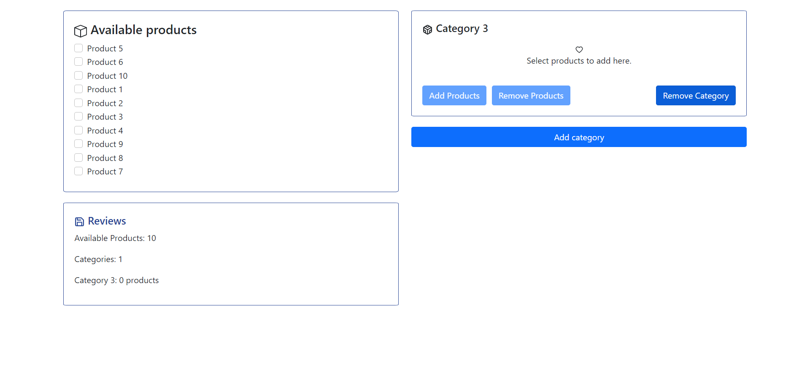

# React Case Study

## Improvements that can be done

### Coding
- Using emotion to create styled components
- Use typescript (usually I prefer using typescript but since its a small project I didn't bother)
- Generally code could be way cleaner

### Features
- Add a redo button (maybe user miss click and delete a category)
- Add alerts for every action a user does (Move things to other categories or vise versa)
